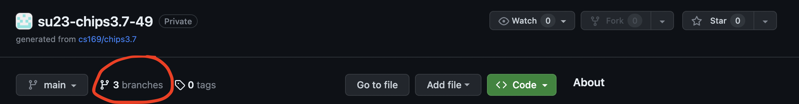
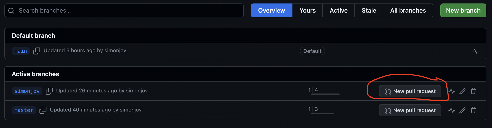
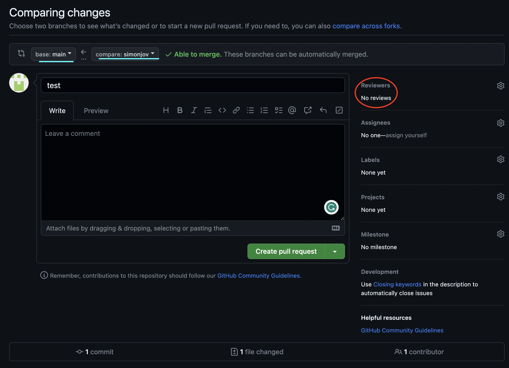

# Part 3: Connecting WordGuesserGame to Sinatra

You've already met Sinatra.  Here's what's new in the Sinatra app skeleton [`app.rb`](../app.rb) that we provide for Wordguesser:

* `before do...end` is a block of code executed *before* every SaaS request

* `after do...end` is executed *after* every SaaS request

* The calls  `erb :` *action* cause Sinatra to look for the file `views/`*action*`.erb` and run them through the Embedded Ruby processor, which looks for constructions `<%= like this %>`, executes the Ruby code inside, and substitutes the result.  The code is executed in the same context as the call to `erb`, so the code can "see" any instance variables set up in the `get` or `post` blocks.

#### Self Check Question

  
<code>@game</code> in this context is an instance variable of what
class?  (Careful-- tricky!)

  
<blockquote>It's an instance variable of the <code>WordGuesserApp</code> class in the app.rb file.  Remember we are dealing with two Ruby classes here: the <code>WordGuesserGame</code> class encapsulates the game logic itself (that is, the Model in model-view-controller), whereas <code>WordGuesserApp</code> encapsulates the logic that lets us deliver the game as SaaS (you can roughly think of it as the Controller logic plus the ability to render the views via <code>erb</code>).</blockquote>

The Session
-----------

We've already identified the items necessary to maintain game state, and encapsulated them in the game class.  Since HTTP is stateless, when a new HTTP request comes in, there is no notion of the "current game".  What we need to do, therefore, is save the game object in some way between requests.

If the game object were large, we'd probably store it in a database on the server, and place an identifier to the correct database record into the cookie.  (In fact, as we'll see, this is exactly what Rails apps do.)  But since our game state is small, we can just put the whole thing in the cookie.  Sinatra's `session` library lets us do this: in the context of the Sinatra app, anything we place into the special "magic" hash `session[]` is preserved across requests.  In fact, objects placed there are *serialized* into a text-friendly form that is preserved for us.  This behavior is switched on by the Sinatra call `enable :sessions` in `app.rb`.

There is one other session-like object we will use.  In some cases above, one action will perform some state change and then redirect to another action, such as when the Guess action (triggered by `POST /guess`) redirects to the Show action (`GET /show`) to redisplay the game state after each guess.  But what if the Guess action wants to display a message to the player, such as to inform them that they have erroneously repeated a guess?  The problem is that since every request is stateless, we need to get that message "across" the redirect, just as we need to preserve game state "across" HTTP requests.

To do this, we use the `sinatra-flash` gem, which you can see in the Gemfile.  `flash[]` is a hash for remembering short messages that persist until the *very next* request (usually a redirect), and are then erased.

#### Self Check Question

  
Why does this save work compared to just storing those
messages in the <code>session[]</code> hash?

  
<blockquote>When we put something in <code>session[]</code> it stays there until we delete it.  The common case for a message that must survive a redirect is that it should only be shown once; <code>flash[]</code> includes the extra functionality of erasing the messages after the next request.</blockquote>

Running the Sinatra app
-----------------------

As before, run the shell command `bundle exec rackup --host 0.0.0.0 --port 3000` to start the app, or `bundle exec rerun -- rackup --host 0.0.0.0 --port 3000` if you want to rerun the app each time you make a code change.

#### Self Check Question

  
Based on the output from running this command, what is the full URL you need to visit in order to visit the New Game page?

  
<blockquote>The Ruby code <code>get '/new' do...</code> in <code>app.rb</code> renders the New Game page, so the full URL is in the form <code>http://localhost:3000/new</code></blockquote>

 

Visit this URL and verify that the Start New Game page appears.

#### Self Check Question

  
Where is the HTML code for this page?

  
<blockquote>It's in <code>views/new.erb</code>, which is processed into HTML by the <code>erb :new</code> directive.</blockquote>

 

Verify that when you click the New Game button, you get an error.  This is because we've deliberately left the `<form>` that encloses this button incomplete: we haven't specified where the form should post to. We'll do that next, but we'll do it in a test-driven way.

Time to PR
----------
Now let's get this local progress onto your remote GitHub repo by making a Pull Request (PR) from your branch to the main branch of your GitHub repo. This can be done directly through the GitHub site by clicking the "`X` branches" button near the top of the repo page.

From here, find your branch and click `New pull request`.

Now make sure that the base branch is `main` and that the compare branch is your own. Then add a title and a description of the changes you've made. Writing a clear PR description is a habit worth building now: on a real project it is how reviewers understand your work, and here it is how *you* will remember what a branch was for when you come back to it.

Before merging, use the PR's "Files changed" tab to review your own diff. Reading your changes as a stranger would is a surprisingly effective way to catch debugging leftovers, commented-out code, and accidental edits before they reach `main`. On a team this is where a reviewer would weigh in; working solo, you are the reviewer. Once you're happy with the diff and any merge conflicts are resolved, merge in your changes!

Now get back on the main branch locally and pull in the newly merged changes with `git checkout main && git pull origin main`.

Deploying to Render
----------

Now, let's get our app onto Render. This is actually a critical step. We need to ensure that our app will run in production **before** we start making significant changes.

Earlier we saw that to run the app locally you run `rackup` to start the Rack appserver, and Rack looks in `config.ru` to determine how to start your Sinatra app. A common convention is a file named `Procfile`, which documents how your app's web process is started. Create a file named `Procfile` (the name only — `Procfile.txt` is not valid) with the following line:

This documents the command to start your web process. Note that Render does not read the `Procfile` automatically — it uses the **Start Command** you set in the dashboard (`bundle exec rackup config.ru -p $PORT`). However, creating a `Procfile` is good practice.

Your local repo is now ready to deploy:

* Run `bundle install` to make sure your Gemfile and Gemfile.lock are in sync.
* Stage and commit all changes: `git add . && git commit -m "Ready for Render!"`
* Push to GitHub: `git push origin main`

Since Render is connected to your GitHub repo and auto-deploy is enabled, pushing to `main` automatically triggers a new build and deployment on Render. No separate push command is needed.

* Verify the deployment by opening your app's URL (`https://<name>.onrender.com`), shown at the top of your service page on the Render dashboard.
* Verify that the Render-deployed Wordguesser behaves the same as your development version before continuing.
* Verify the broken functionality by clicking the new game button.

Use `git checkout [YOUR_BRANCH_NAME]` to switch back to your branch once you're ready to start making more changes. For all future deployments to Render, simply commit to `main` and push — Render will pick them up automatically.

---

[← Part 2: RESTful thinking for Wordguesser](03-Part-2--RESTful-thinking-for-Wordguesser.md) | [Contents](README.md) | [Part 4: Introducing Cucumber →](05-Part-4--Introducing-Cucumber.md)
